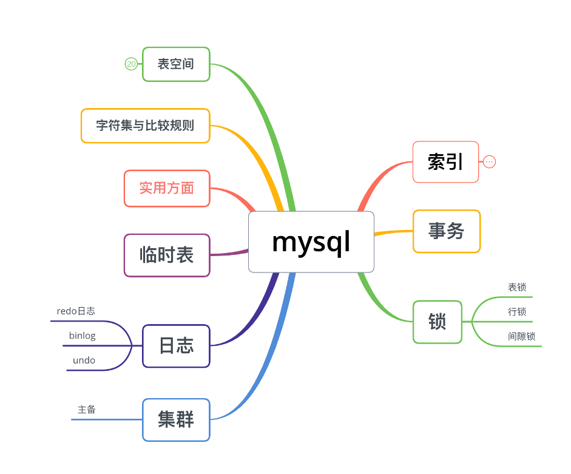

当我们提起一些后端技术用到的中间件、存储时，第一反应可能就是mysql关系型数据库了。
确实，作为后端开发的我，几乎每天都在和mysql打交道，很负责任地说，我们团队研发的绝大多数服务都是"跑在mysql上"的。
所以认识mysql的内部实现是很有必要的！！在没有深入了解mysql内部实现的这几年里，我遇到过好几个奇葩的问题：

1、线上主从不同步

2、本地服务一个查询居然话花了30多秒直到服务超时，但是整个数据库表只有可怜的几百条数据！！！

3、本地一个简单的批量插入居然花了8秒，百条数据空表插入8秒！！

4、集群主从切换后节点全变成readonly，无法提供写入服务。

除去上面这些奇葩问题，如果一条查询或者插入只需要几百个毫秒就真的没有问题了吗？

都说一个只会CURD的攻城狮不是好的攻城狮，所以我们有必要深入了解一下mysql的实现。

但要全部了解mysql，其实有些不现实，所以我想跟大家学习一下mysql的一些主要部分，包括：索引、MVCC（多版本并发控制）、日志（bin log，redo log、undo log）、事务、集群、老大哥->锁。如果大家不觉得无聊和枯燥的话，我们还可以来聊聊mysql的表空间。

## 什么是索引？

2021年的第一次分享和学习，我想先从索引开始，毕竟，索引算是上述这些部分里面最简单的一个了。索引呢，其实就是大家翻书时的目录，可以让你快速定位到某个章节在哪一页，这样说大家应该就是很熟悉并且有个概念了。快速定位，减少顺序查询就是索引的主要作用。
但mysql的索引肯定不是这么简单的, 不然就不会有这次学习分享嘛~~

## 这一次分享能有什么收获？

这次分享主要有mysql索引的组织结构、用户记录结构相关的讲解，这部分的设计可以回答下面的几个问题：

1、为什么阿里的后端手册里不建议将text字段写到mysql里？那text等字段要保存到哪里？

2、为什么我常说这个功能不支持模糊搜索（这里的模糊搜索只是简单的like~~不是真正意义上的模糊搜索），只能搜索：史珍香或者史珍*，而不能搜索： *珍香，需求一定要的情况下，这种问题有办法解决吗？

3、排序有时候是个地狱，而我们的产品常常需要多种条件排序，例如按学习时间、年级、学科、热度4维排序，简直是地狱中的地狱~~ 有办法提高排序的性能吗？

4、索引很好用，但是不是索引越多越好呢？

